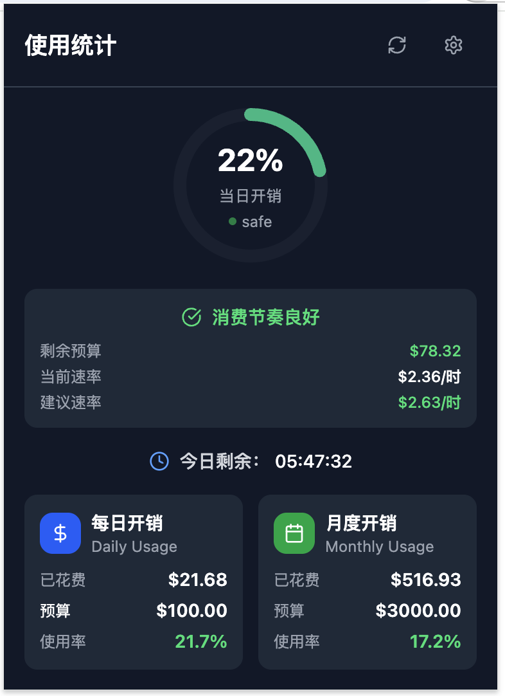
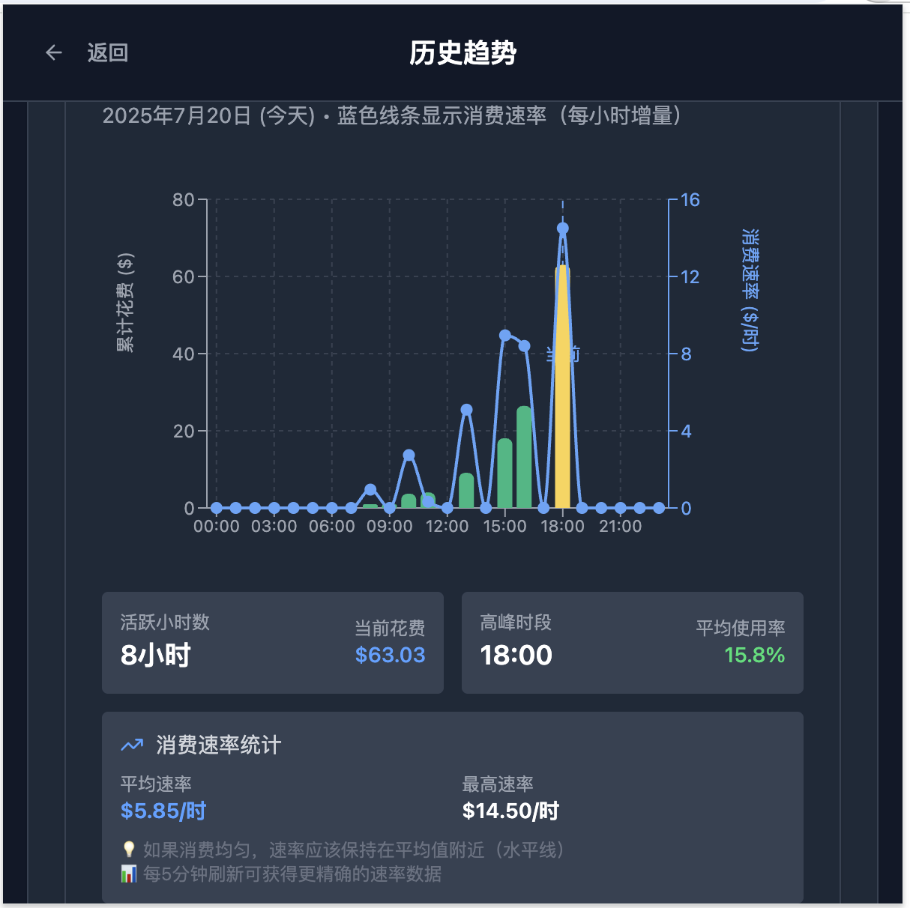

# CC Usage Monitor | API 使用量监控插件

<div align="center">


[](LICENSE)
[]()
[]()
[]()

</div>

## 📝 项目简介

CC Usage Monitor 是一款专为 Claude Code 用户设计的浏览器插件，用于实时监控 Claude Code 的使用量和预算消费情况。通过智能的预算管理和直观的数据可视化，帮助您更好地控制 Claude Code 的使用成本。

### ✨ 核心特性

- 🎯 **智能预算监控** - 实时跟踪月度/日度预算使用情况
- 🤖 **智能字段匹配** - 自动识别 API 响应中的预算和花费字段
- ⏰ **工作时间配置** - 根据工作时间计算消费速率，提供精准警示
- 📊 **数据可视化** - 圆形进度条、状态卡片和历史趋势图表
- 🌙 **现代化界面** - 深色主题设计，视觉体验优雅
- 🔄 **实时更新** - 60 秒智能缓存，降低 API 负载
- 🚨 **智能警示** - 可自定义的多级预算警示系统
- 🔔 **智能通知** - 后台监控，预算超限自动提醒
- 📈 **历史分析** - 支持历史数据记录和趋势分析
- ⚡ **高性能** - 基于 Zustand 的现代化状态管理

## 🎬 功能演示




### 主界面 - Popup

- 圆形进度指示器显示当日预算使用率
- 实时倒计时显示当天剩余时间
- 智能预算警示，基于工作时间计算消费速率
- 月度和日度预算卡片展示

### 设置页面 - Options

- API 连接配置（URL + Token）
- 工作时间双滑块选择器
- 智能字段映射，自动匹配预算字段
- 置信度评估和视觉反馈

## 🚀 安装方式

### 方式一：插件市场安装（推荐）

#### Chrome Web Store

1. 访问 [Chrome Web Store](https://chrome.google.com/webstore)
2. 搜索 "CC Usage Monitor"
3. 点击"添加至 Chrome"

#### Firefox Add-ons

1. 访问 [Firefox Add-ons](https://addons.mozilla.org)
2. 搜索 "CC Usage Monitor"
3. 点击"添加到 Firefox"

### 方式二：开发者模式安装

#### 下载安装包

1. 访问 [Releases 页面](https://github.com/yoyooyooo/cc-usage-extension/releases)
2. 下载最新版本的 `.zip` 文件
3. 解压到本地文件夹

#### Chrome 安装步骤

1. 打开 Chrome 浏览器
2. 访问 `chrome://extensions/`
3. 开启右上角的"开发者模式"
4. 点击"加载已解压的扩展程序"
5. 选择解压后的文件夹

#### Firefox 安装步骤

1. 打开 Firefox 浏览器
2. 访问 `about:debugging`
3. 点击"此 Firefox"
4. 点击"临时加载附加组件"
5. 选择解压文件夹中的 `manifest.json`

## ⚙️ 使用指南

### 初次配置

1. **点击插件图标**，打开弹窗界面
2. **点击设置按钮**（⚙️），进入配置页面
3. **填写 API 配置**：
   - API URL：您的 API 端点地址
   - Token：访问令牌（安全存储）
4. **配置工作时间**（可选）：
   - 使用双滑块选择工作时间区间
   - 默认为 09:00 - 24:00
5. **测试连接**：
   - 点击"测试连接"验证 API 可用性
   - 系统将自动运行智能字段匹配
6. **确认字段映射**：
   - 查看自动匹配结果（蓝色边框 + ✨ 图标）
   - 查看置信度和匹配原因
   - 手动调整映射（如需要）
7. **保存配置**

### 日常使用

- **查看预算状态**：点击插件图标即可查看实时数据
- **预算警示**：系统会根据消费速率自动提供警示
- **更新数据**：点击刷新按钮手动更新（有 60 秒缓存）

## 🛠️ 开发指南

### 环境要求

- Node.js >= 16
- Bun（推荐的包管理器）
- Chrome/Firefox 浏览器

### 安装依赖

```bash
bun install
```

### 开发命令

```bash
# 开发模式（Chrome）
npm run dev

# 开发模式（Firefox）
npm run dev:firefox

# 构建生产版本
npm run build            # Chrome
npm run build:firefox    # Firefox

# 类型检查
npm run compile

# 创建发布包
npm run zip              # Chrome
npm run zip:firefox      # Firefox
```

### 项目结构

```
cc-usage/
├── entrypoints/          # 入口点
│   ├── popup/           # 弹窗界面
│   ├── options/         # 设置页面
│   ├── background.ts    # 后台脚本
│   └── content.ts       # 内容脚本
├── components/          # React 组件
│   ├── ui/             # shadcn/ui 基础组件
│   ├── DataCard.tsx    # 数据卡片
│   ├── CircularProgress.tsx  # 圆形进度条
│   └── SettingsView.tsx      # 设置视图
├── utils/              # 工具函数
│   ├── api.ts         # API 相关
│   ├── storage.ts     # 存储管理
│   └── fieldMatcher.ts # 智能字段匹配
└── types/             # TypeScript 类型
```

### 核心技术栈

- **框架**: WXT (基于 Vite)
- **前端**: React 19 + TypeScript
- **样式**: Tailwind CSS + shadcn/ui
- **状态管理**: Zustand（轻量级、高性能）
- **数据可视化**: Recharts（图表库）
- **存储**: chrome.storage.sync/local
- **构建**: Vite + TypeScript

## 🔧 API 数据格式

### 期望的 API 响应格式

插件支持灵活的 JSON 响应格式，通过智能字段匹配自动识别：

```json
{
  "monthlyBudget": 1000,
  "monthlySpent": 650,
  "dailyBudget": 50,
  "dailySpent": 25
}
```

### 支持的字段命名风格

- **驼峰命名**: `monthlyBudget`, `dailySpent`
- **下划线命名**: `monthly_budget`, `daily_spent`
- **短横线命名**: `monthly-budget`, `daily-spent`
- **嵌套对象**: `budget.monthly`, `usage.daily`

### 智能匹配规则

| 槽位     | 匹配关键词         | 示例字段                    |
| -------- | ------------------ | --------------------------- |
| 月度预算 | month + budget     | monthlyBudget, month_budget |
| 月度花费 | month + spent/used | monthlySpent, month_used    |
| 日度预算 | daily + budget     | dailyBudget, daily_budget   |
| 日度花费 | daily + spent/used | dailySpent, daily_used      |

## 🔒 隐私与安全

- **本地存储**: 所有配置数据存储在浏览器本地
- **Token 保护**: API Token 使用安全存储，不会明文显示
- **无数据收集**: 插件不会收集或上传任何用户数据
- **权限最小化**: 仅请求必要的浏览器权限

## 🤝 贡献指南

欢迎贡献代码！请遵循以下步骤：

1. Fork 本仓库
2. 创建特性分支 (`git checkout -b feature/AmazingFeature`)
3. 提交更改 (`git commit -m 'Add some AmazingFeature'`)
4. 推送到分支 (`git push origin feature/AmazingFeature`)
5. 创建 Pull Request

### 开发规范

- 使用 TypeScript 编写代码
- 遵循现有的代码风格
- 添加适当的注释和类型定义
- 确保所有功能都经过测试

## 📋 更新日志

### v1.2.1 (2025-01-19) - 状态管理重构

- ⚡ **架构升级** - 重构为 Zustand + Chrome Storage 统一数据源架构
- 🔧 **数据流优化** - 解决状态重复维护和 ref 通信复杂度问题
- 🐛 **修复保存问题** - 解决设置保存按钮失效的时序问题
- 📈 **性能提升** - 简化组件通信，提高状态同步效率
- 🛡️ **类型安全** - 完整的 TypeScript 类型检查支持

### v1.2.0 (2025-01-19) - 历史数据与图表

- 📊 **历史数据记录** - 自动保存每次刷新的预算数据
- 📈 **多种图表视图** - 支持趋势图和 24 小时时间线图表
- 🎯 **自定义警示阈值** - 可配置的 4 级预算警示系统
- 📤 **数据导出功能** - 支持 CSV 格式的历史数据导出
- 💾 **智能存储策略** - 自动去重和 30 天数据保留机制

### v1.1.0 (2025-01-19) - 智能通知系统

- ✨ 新增智能通知功能 - 自定义阈值和查询间隔
- 🔔 支持日度/月度预算警告通知
- ⏰ 可配置的后台定时查询（1-60 分钟）
- 🎯 阈值配置支持 50%-95%范围
- 🔄 每日/月度自动重置通知状态
- 💡 优化设置界面，新增通知配置区域

### v1.0.0 (首次发布)

- ✨ 智能字段匹配功能 - 自动识别 API 响应中的预算和花费字段
- 🔍 置信度评估和视觉反馈 - 提供匹配原因说明
- 🎨 现代化深色主题设计 - 优雅的用户界面
- 🎯 圆形进度指示器 - 直观显示使用率
- ⏱️ 实时倒计时功能 - 当天剩余时间
- ⚠️ 智能预算警示系统 - 6 级警示提醒
- ⏰ 工作时间配置功能 - 精准的消费速率计算
- 📊 数据可视化卡片 - 清晰的预算展示

## 🐛 问题反馈

如果您遇到问题或有功能建议，请：

1. 查看 [FAQ](https://github.com/yoyooyooo/cc-usage-extension/wiki/FAQ)
2. 搜索 [已知问题](https://github.com/yoyooyooo/cc-usage-extension/issues)
3. 创建新的 [Issue](https://github.com/yoyooyooo/cc-usage-extension/issues/new)

## 📄 许可证

本项目基于 [MIT License](LICENSE) 开源协议。

## 🙏 致谢

- [WXT Framework](https://wxt.dev/) - 现代化扩展开发框架
- [shadcn/ui](https://ui.shadcn.com/) - 优雅的 UI 组件库
- [Tailwind CSS](https://tailwindcss.com/) - 实用的 CSS 框架
- [Lucide React](https://lucide.dev/) - 精美的图标库

---

<div align="center">

**如果这个项目对您有帮助，请给个 ⭐️ Star 支持！**

[🌟 GitHub](https://github.com/yoyooyooo/cc-usage-extension) | [💬 反馈](https://github.com/yoyooyooo/cc-usage-extension/issues) | [📖 文档](https://github.com/yoyooyooo/cc-usage-extension/wiki)

</div>
